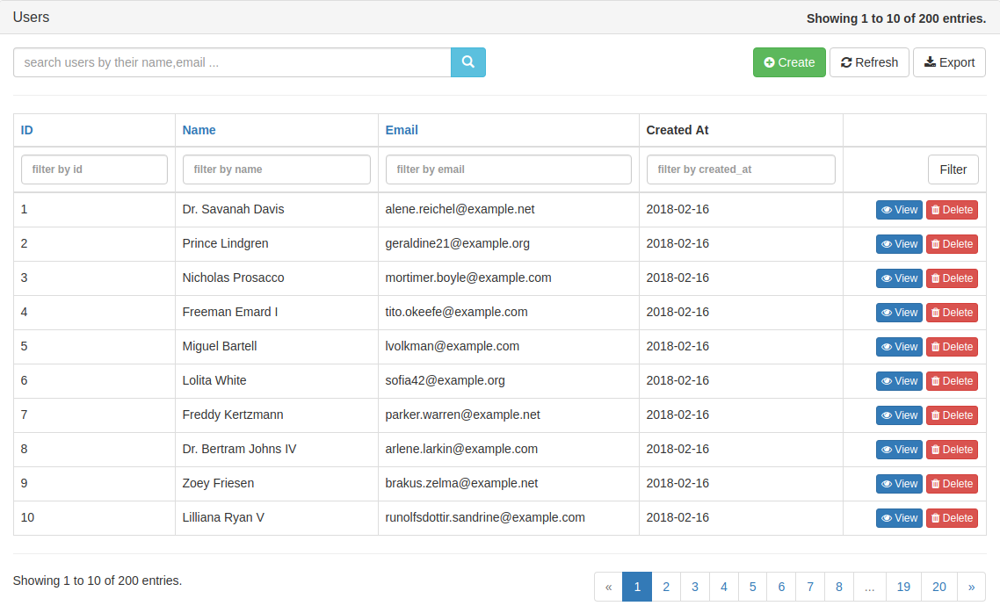

# Laravel grid (laravel 5.5+)
This package allows rendering of data via a tabular format (grid). 
The grid uses bootstrap classes to style the `table` elements. Icons used are from `font-awesome`

## Requirements
The grid is [pjax](https://github.com/defunkt/jquery-pjax) ready out of the box. You can use this package - [spatie/laravel-pjax](https://github.com/spatie/laravel-pjax), or create the middleware on your own using [jeffrey way's middleware](https://gist.github.com/JeffreyWay/8526696b6f29201c4e33)

+ Bootstrap 3 (for the styling)
+ Font awesome (for icons)
+ Jquery (for the grid.js)
+ Jquery pjax (quickly view data without having to reload the page)
+ [Block UI](https://github.com/malsup/blockui) (optional)
+ [Date picker](https://github.com/uxsolutions/bootstrap-datepicker.git) (optional)

## Installation
The package is available on composer. Just run;
```bash
composer install leantony/laravel-grid
```

## Usage
A laravel command is available to make it easy to create grids. 
Once installed, just run the command:
```bash
php artisan make:grid --model=modelClass
```

Just make sure you replace `modelClass` with your actual `eloquent` model class.
Once this happens, a grid will be generated. Default namespace for grid generation is `App\Grids`.

Once the generation of the grid is done, you can add add it in your controller like this. E.g a `user` model grid:
```php
class UsersController extends Controller
{
    /**
     * Display a listing of the resource.
     *
     * @param UsersGridInterface $usersGrid
     * @param Request $request
     * @return \Illuminate\Http\Response
     */
    public function index(UsersGridInterface $usersGrid, Request $request)
    {
        // the 'query' argument needs to be an instance of the eloquent query builder
        $grid = $usersGrid->create(['query' => User::query(), 'request' => $request]);

        return view('welcome', ['grid' => $grid]);
    }
}
```
> If you inject the interface on the controller, just make sure that you add a binding to the service provider. Like so;
```php
     /**
     * Register any application services.
     *
     * @return void
     */
    public function register()
    {
        $this->app->bind(UsersGridInterface::class, UsersGrid::class);
    }
```

Otherwise, you can also instantiate the grid class like this; You can then inject any constructor dependencies you might need.
```php
    /**
     * Display a listing of the resource.
     *
     * @param Request $request
     * @return \Illuminate\Http\Response
     */
    public function index(Request $request)
    {
        $grid = (new UsersGrid())->create(['query' => User::query(), 'request' => $request]);

        return view('welcome', ['grid' => $grid]);
    }
```

Ensure that your view/layout looks something like [this](https://gist.github.com/leantony/4a7a795904c60b6b7f91431e4241e37b). Especially with the javascript dependencies. 
The example is based off the grids sample application, which can be found [here](https://github.com/leantony/laravel-grid-app). The modal and its included view are not really required, so feel free to leave them out.
> The grid injects its javascript into the `@stack('scripts')` section, so please ensure that you have this on your layout

Then display the grid on your view like this;
```php
{!! $grid !!}
```

You should see something like this...


To customize the grid, check out [the customization section](docs/customization.md)

# TODO's
+ Add unit tests (in progress)
+ Fix issues with downloading of PDF reports